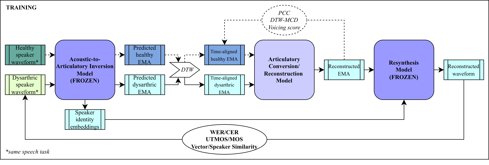

# PhD project
Conferences to consider:
* CARE Research Day: April 17, 2026
* 2026 ASHA: November 19-21, 2026, Indiana 
    * Submission deadline: TODO
* 2026 IEEE Spoken Language Technology Workshop (SLT): December 13-16, 2026, Palermo, Italy
    * Submission deadline: TODO

# Package install
`conda install ffmpeg`
`cd  ./phd_project`
`pip install .`

# Model Pipeline

# TODO
1. SPLIT DATA
4. SPARC model implementation - separate EMA and resynth, separate speaker identity
5. WER/CER 
6. UTMOS
7. Speaker/vector similarity metrics
8. Start building conversion model

